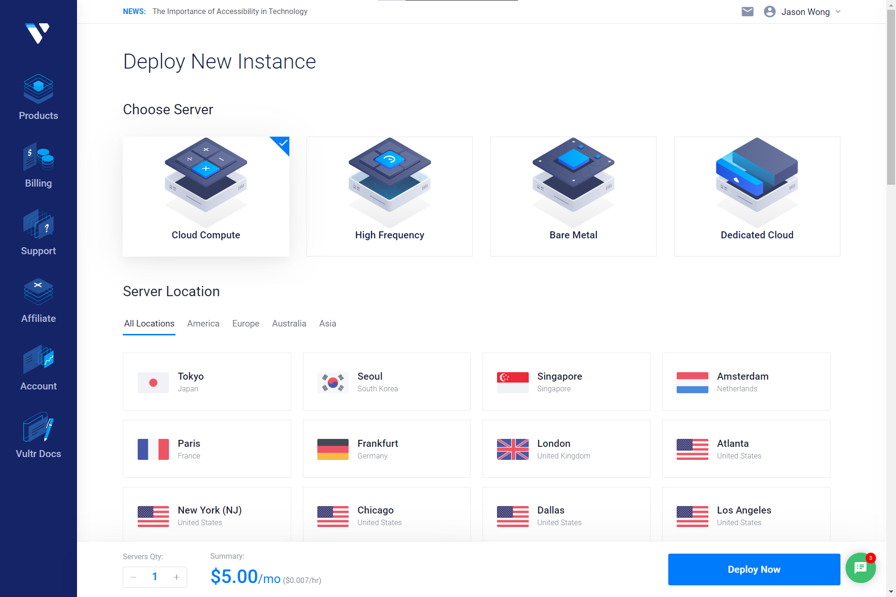
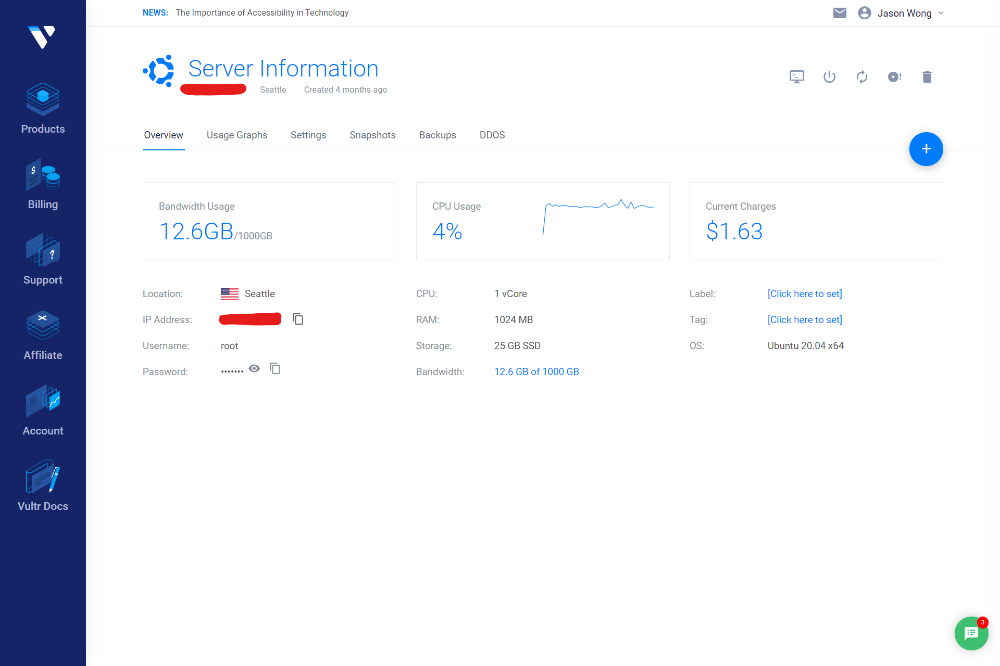

# The Art of Building Stairs

[TOC]

## What do we need to build a enough-to-use stair ?

First of all, before building a stair, you need to realize why you need it. 

> ### Why do we need our own stairs ?
> Well, the prime reason that drove me to build my own stair is that, I want to watch some YouTube videos, but the stairs offered in the software store were either too slow or too much ads. In a word, stairs are essential but they are not good enough to me. That's why I learnt to use `v2ray` to build my own stair in the beginning.
> Now, I am using stairs to obtain the infomation I need to accomplish my homework and projects, while learn extra skills from people all over the world. 
> For me, stairs are useful tools.
> 
> You may have your own reasons. That's fine. After all, motivations drive actions. But DON'T turn stairs into weapons. Keep that in mind.

Then, you need to prepare some essential things as below :
- **A computer**, the one that is Internet-connected, which you use daily.
- **A server**, the one that locates outside China Mainland, which you have access to. My suggestion is to rent one from [Vultr](https://www.vultr.com). It is only \$5 per month.
- **A set of VPN software**, which refers to `v2ray-core` for the server and a client, which differs according to what platform you're using.
- **Some tools**, which refers to a SSH client and a SFTP client (if needed). Currently, I'm using OpenSSH.
- (Optional)**Other perfect tools**, which are not essentially necessary, but could be really helpful to lighten your work.

If you've got all these things prepared, we can begin then.

## First step, set up your server.

Go to [Vultr](https://www.vultr.com) and sign in. Find your way to deploy a new instance. Choose `Cloud Compute`, `Seattle` and `Ubuntu 20.04`. Select the \$5 plan. Then, deploy.



Congratulation ! Now you have a virtual server in Seattle.

After the website finishing setting up your server, you are able to use. But firstly, find the following infomation and mark them down securely, because you are going to need them later.
- IP address
- Password



Now, open your SSH client. I'm using `Windows Terminal` as my SSH accessory. Use `ssh {Username}@{IP address}` to login in to your server. Here, the `{Username}` refers to `root` since no other users have been created. Then, paste your password copied from the website. Please notice that the password would not be displayed as you're typing in.

> Please be really careful to what you are typing since now, because you are working as `root`, the god in a Linux system.

Type in the following commands to initialize. Notice that, there is no need to type the `$` sign together.

```
# This will get your softwares up to date.
$sudo apt update && sudo apt -y upgrade
```

## Deploy v2ray to your server.

There are plenty of instructions on how to deploy v2ray to your server, so I'm just going to show you the path and give you a sample of config files.

### 1 Instruction Pages

[v2fly.org](https://guide.v2fly.org/)

[Deploying v2ray by Docker | v2ray Beginner's Guide (v2fly.org)](https://guide.v2fly.org/en_US/app/docker-deploy-v2ray.html)

### 2 Github Sources

[v2ray-core](https://github.com/v2fly/v2ray-core)

[v2ray installation script](https://github.com/v2fly/fhs-install-v2ray)

### 3 Install & Update

```bash
wget https://raw.githubusercontent.com/v2fly/fhs-install-v2ray/master/install-release.sh
sudo bash install-release.sh
```

### 4 Generate a UUID

`UUID` is also called `GUID` in Windows. You can generate one with the help of some websites.

### 5 Modify Configurations

The config file locates at `/usr/local/etc/v2ray/config.json`.

#### 5.1 Server Configuration

> *Comments need to be removed before applying.*
> *Replace all the {content} with your actual contents.*

```json
{
  "inbounds": [
    {
      "port": {VPN server port}, // Server listening port
      "protocol": "vmess",    // main transfering in protocal
      "settings": {
        "clients": [
          {
            "id": "{UUID}",  // UUID, keep it same between server and client
            "alterId": 16   // Just a number, but keep it same between server and client
          }
        ]
      }
    }
  ],
  "outbounds": [
    {
      "protocol": "freedom",  // main transfering out protocal
      "settings": {}
    }
  ]
}
```

For a transit use server:

```json
{
  "outbounds": [
    {
      "protocol": "vmess",
      "settings": { 
        "vnext": [
          {
            "address": "{IP address of VPN server}",
            "port": {VPN server port},
            "users": [
              {
                "alterId": 16,
                "id": "{UUID}"
              }
            ]
          }
        ]
      },
      "proxySettings": {
          "tag": "transit"  // The tag here must be the same as the tag of proxy VPS.
        }
    },
    {
      "protocol": "vmess",
      "settings": {
        "servers": [
          {
            "address": "{IP address of transit server}",
            "method": "aes-256-cfb",
            "ota": false,
            "password": "password",
            "port": {Transit server port}
          }
        ]
      },
      "tag": "transit"
    }
  ]
}
```

#### 5.2 Client Configuration 

```json
{
  "inbounds": [
    {
      "port": 1080, // Client listening port
      "protocol": "socks", // Import protocal
      "sniffing": {
        "enabled": true,
        "destOverride": ["http", "tls"]
      },
      "settings": {
        "auth": "noauth"
      }
    }
  ],
  "outbounds": [
    {
      "protocol": "vmess", // Export protocal
      "settings": {
        "vnext": [
          {
            "address": "{IP address of VPN / transit server}", // If the client connects to the VPN server directly, then it should be the IP address of the VPN server and the following settings should match it as well. Otherwise, match the setting of the transit server.
            "port": {VPN / Transit server port}, 
            "users": [
              {
                "id": "{UUID}",  
                "alterId": 16 
              }
            ]
          }
        ]
      }
    }
  ]
}
```

> *Comments need to be removed before applying.*
> *Replace all the {content} with your actual contents.*

### 6 Modify v2ray Services

#### Start & Stop v2ray 

```Linux
# systemctl start v2ray
```

#### Enable v2ray Bootup

```Linux
# systemctl enable v2ray
```

#### Check Status

```Linux
# systemctl status v2ray
```

## Get ready to use.

`v2ray` itself could be both server and client. There are plenty of GUI clients for `v2ray` as well. Just type in the info, and it'll be work.

## Good job !

If you successfully reach here, that means you are able to use your own stair now. Welcome to the outside world !

### HOWEVER !!!

Please keep in mind why you build this stair. Stairs are tools. Whether they are helpful or harmful is decided by the person who uses it. So please **DON'T** use it as weapon. 

Keep an eye on what you have said.
Keep in mind who you are and where you come from.
You are representing not only you, but also your motherland.

I wish you get what you want while the world remian peace.